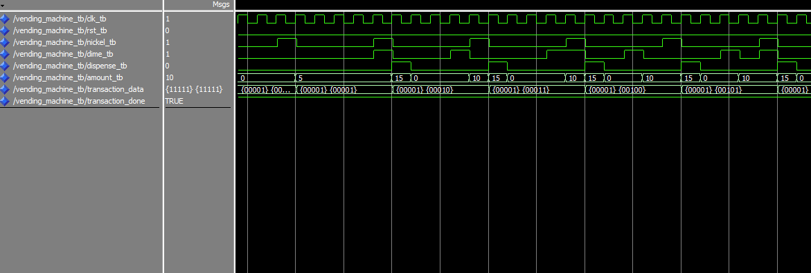
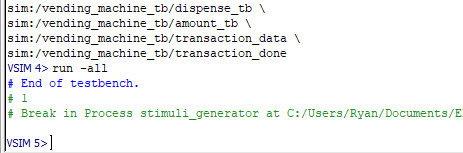

# Homework 5: Vending Machine VHDL

## Overview
I wrote vhdl code that implemented a simple vending machine as a state machine with four states.

## Deliverables
Here are screenshots of my ModelSim waveform, where a portion of the testbench's execution is shown along with the accurate functionality of my vending machine in response to the inputs. There were no errors in the transcript.

