# HW 7: Linux CLI Practice

## Overview
For this homework, I practiced using varius Linux terminal commands like wc, sort, cut, head, tail, grep, and find, along with the various ways they can be used together with redirection and regular expressions. It's worth noting that I change directories several times in between commands, so they're not all relative to the same file.

## Deliverables

### Problem 1
`wc -w lorem-ipsum.txt`
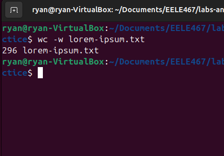

### Problem 2
`wc -m lorem-ipsum.txt`
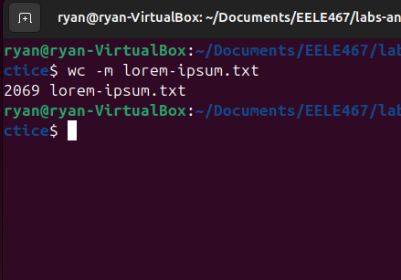

### Problem 3
`wc -w lorem-ipsum.txt`
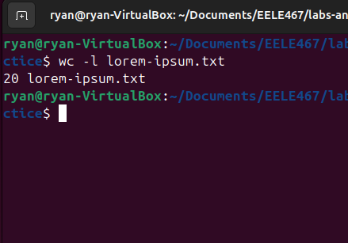

### Problem 4
`wc -l lorem-ipsum.txt`
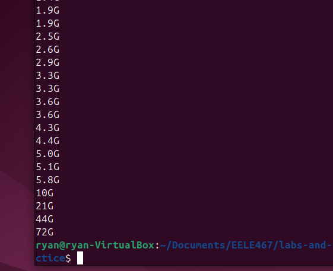

### Problem 5
`sort -h -r file-sizes.txt`
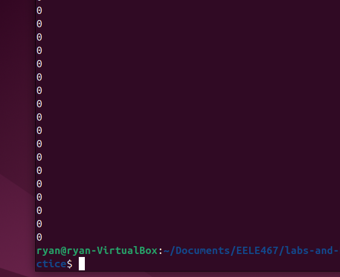

### Problem 6
`cut --fields=3 --delimiter=, log.csv`
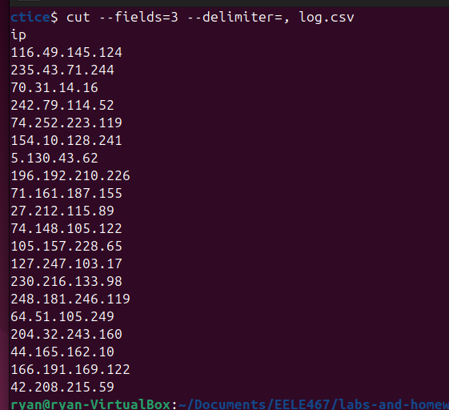

### Problem 7
`cut --fields=2,3 --delimiter=, log.csv`
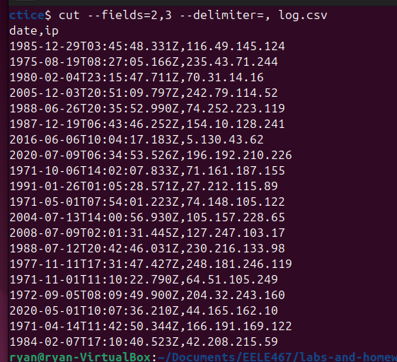

### Problem 8
`cut --fields=1,4 --delimiter=, log.csv`
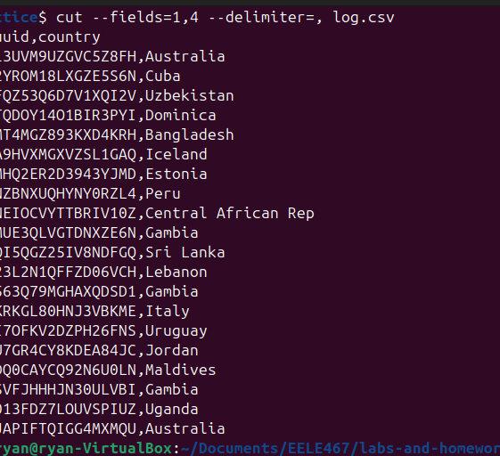

### Problem 9
`head --lines=3 gibberish.txt`
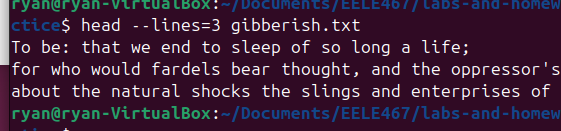

### Problem 10
`tail --lines=2 gibberish.txt`
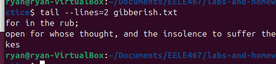

### Problem 11
`tail --lines=-20 log.csv`
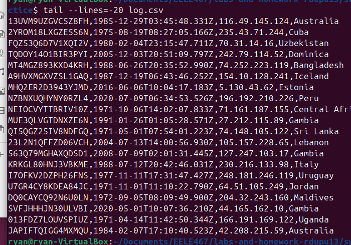

### Problem 12
`grep -i -o and gibberish.txt`
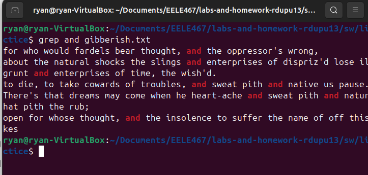

### Problem 13
`grep -i -o '\<we\>' gibberish.txt`
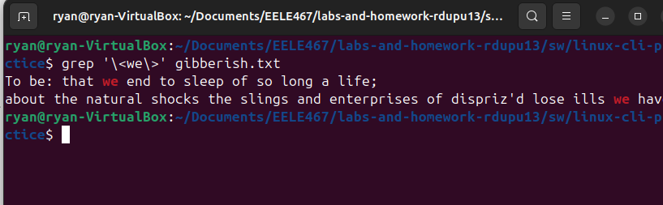

### Problem 14
I couldn't get this one to work...
`grep -i -o 'to [insert correct regex]' gibberish.txt`
See: trying_to_figure_out_grep.txt

### Problem 15
`grep -c -o FPGAs fpgas.txt`
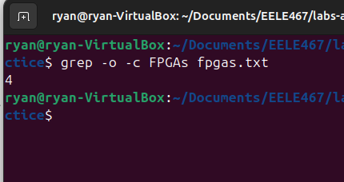

### Problem 16
`grep '(.*(ot|wer|ile))' fpgas.txt`
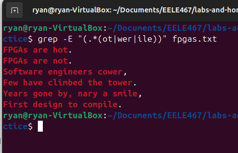

### Problem 17
`grep -r -o -c '^\-\-' ../../hdl/`
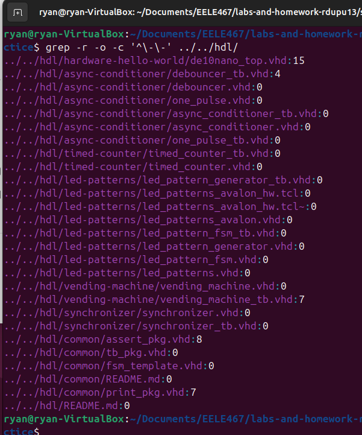

### Problem 18
`ls ../ > ls-output.txt`
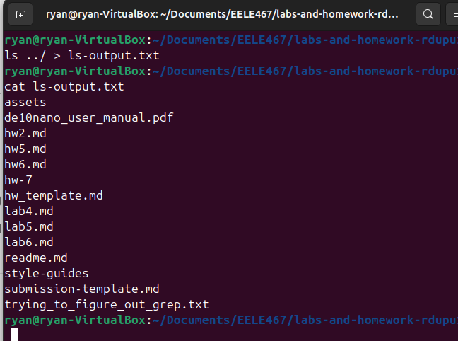

### Problem 19
`sudo dmesg | grep 'CPU'`
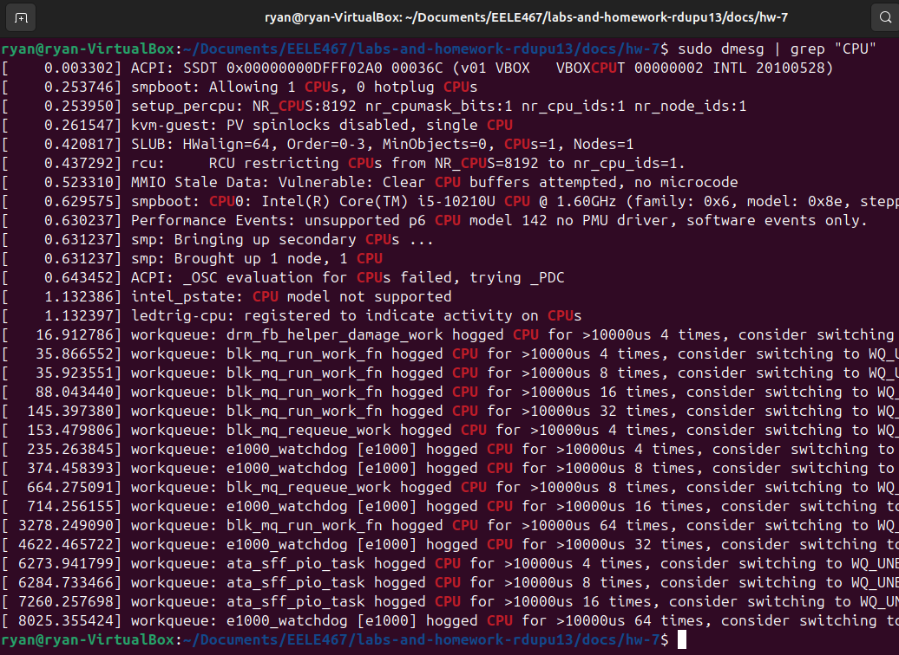

### Problem 20
`find hdl/ -iname '*.vhd' | wc -l`
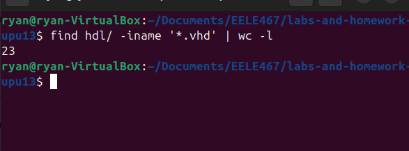

### Problem 21
`grep -r '^--' hdl/ | wc -l`
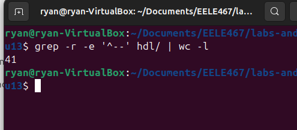

### Problem 22
`grep -n FPGAs fpgas.txt | cut -c-1`
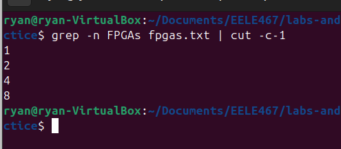

### Problem 23
`du -h * | tail --lines=3`
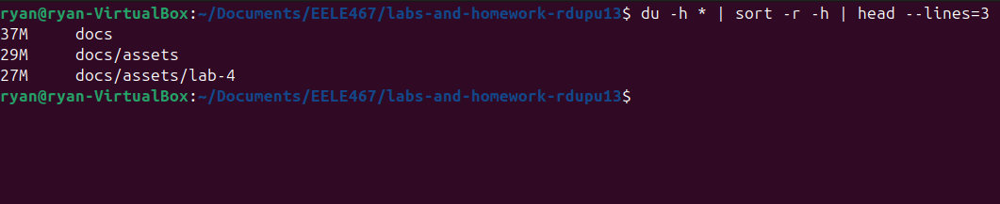

