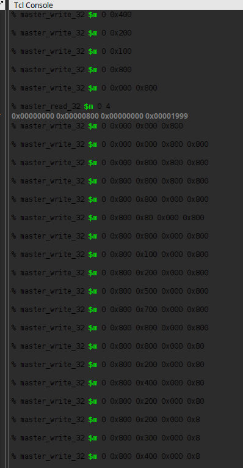

# Homework 10: PWM RGB LED Controller

## Overview
Despite what the amount of abbreviation in the title might suggest, this lab was fairly straightforward.
I created a Quartus project that instantiated my PWM Controller from the previous homework three times.
I also created 4 Avalon registers that can control the duty cycles of each color and the overall period.

Since there was one controller for each red, green, and blue input to the red-green-blue light-emitting
diode(s), I mapped the ports from the controller to three GPIO pins, where they connect the simple
circuit on my breadboard. Since the forward voltage of the green and blue inputs is around 3 v, I
calculated that a 15 ohm resistor is needed to absorb the extra 0.3 v at 20 mA. The closest I could get
was 22 ohms, so that was used. I combined a 47 ohm resistor in series with a third 22 ohm resistor to
get close enough to the required 65 ohms for the red input. Included is a picture of my calculations
because I'm in too much of a hurry to learn about LaTeX.

Using the same procedure as Labs 6 and 7, I created a custom component in Platform Designer along with
a JTAG to Avalon Master component in order to communicate with the HPS through the 4 registers. After
some debugging, I was able to successfully change the register values using System Console.

## Deliverables

