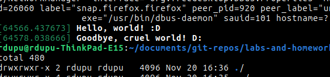
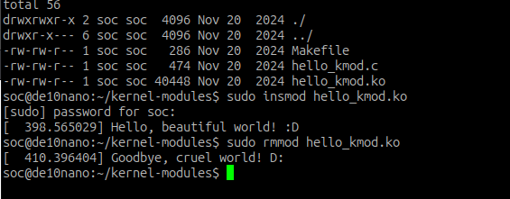
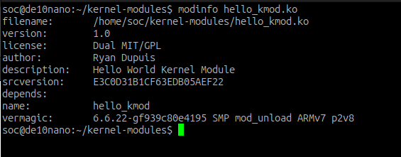
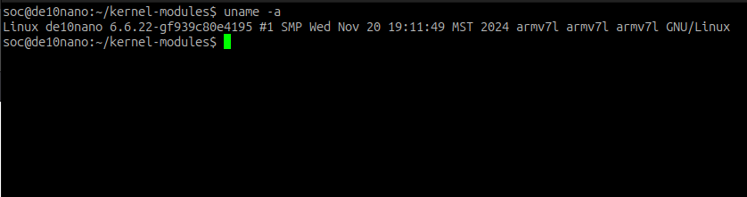

# Homework 8: "Hello world!" Linux Kernel Module

## Overview
In this lab, I build my first kernel module, which simply prints a message upon being loaded by the
kernel and being removed by the kernel. In unknowing preparation, I thankfully read the first third of
How Linux Works (Third Edition) by Brian Ward, where much of the basic structure of linux is explained.
This includes but isn't limited to memory management, userspace vs. kernel space, CPU privalege level,
process management, basic commands, and the filesystem's usual structure.

I began by trying and failing to read some unhelpful documentation, which confused me even more than
the lab pdf handout did. I essentially copied the needed module code and makefile, but I had trouble
learning how to use it. After realizing all I needed was to type "make", I was a little annoyed. I was
able to insmod and rmmod by new kernel module, which printed their correct respective messages.

Switching to the DE10-Nano was simple. It required cloning the linux kernel repository for the board,
which is able to compile the makefile natively on my laptop. Some parameters needed to change in the
makefile first, but once it compiled I was able to load and unload the module on the SoC as well.

## Deliverables

Successful use of insmod and rmmod on Ubuntu laptop.

Successful use of insmod and rmmod on DE10-Nano.

Information on my kernel module.

Information on the linux system.
