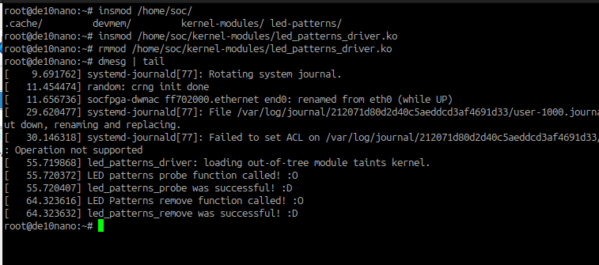
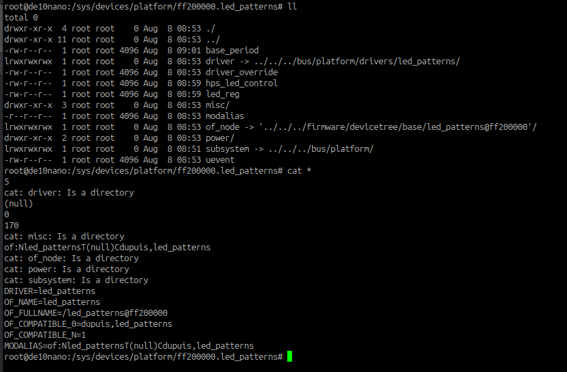

# Lab 11: Writing a Platform Device Driver for LED Patterns

## Overview
In my final installment in the LED patterns franchise, I wrote (copied) an LED patterns kernel module device driver
for my LED patterns component. I combined what I learned in homework 8 (kernel modules and compiling using the
linux-socfpga repo) with what I learned in lab 10 (device trees). This lab consisted of three parts, each with their
own 

In order to write a platform driver, I needed to implement a ```struct platform_driver``` with associated
```probe()``` and ```remove()``` methods, which are called when the driver is inserted and removed respectively.
Then, we need a compatible property in the .of_match_table that matches the compatible property in our device tree
node. This is very important, as it allows the driver to be matched with its device. This property comes in the form
of a string, mine being "dupuis,led_patterns".

The ```probe()``` function must initialize the device by allocating kernel memory, remapping the device's registers
to the kernel's virtual memory, registering it with the miscdev subsystem, and defining its attrubutes. The
```remove()``` function performs any necessary wrap-up operations on the device and deregisters it as a miscdev
device. Deregistering should automatically de-allocate kernel memory for me.

Next, the miscdev subsystem requires the file operation struct with methods ```read()``` and ```write()```. These
methods define what occurs when a user reads or writes to the /dev/led_patterns character device file, which is
automatically created by the subsystem.

To also use the sysfs subsystem, the driver requires ```show()``` and ```store()``` methods for *each* attribute
(so many methods!). These methods handle conversions between ascii inputs to the specific datatypes in the
attribute method. The subsystem automatically creates files in /sys for interaction with userspace.

With the subsystems in place, a user (superuser) can read and write to files to interact with the led_patterns
device. This was a fun and insightful lab!

## Deliverables


A test of ```sudo insmod``` and ```sudo rmmod``` on the platform driver (bare minimum).


Using sysfs subsystem to read/write to led_patterns attributes.

### Questions 

> What is the purpose of platform bus?
	
	The platform bus is a virtual bus that provides a way for the Linux kernel to discover platform drivers that would
	otherwise be non-discoverable.
	
>  Why is the device driver's ```compatible``` property important?
	
	The compatible property is used to match a node in the device tree subsystem with a pre-defined string in a driver
	so that the device can be bound to the driver. It's important that the strings match exactly.
	
	```compatible = "dupuis,led_patterns";```
	
> What does the ```probe``` function do?
	
	The probe function is called by the kernel when a platform/device driver module is inserted. It should initialize
	the device by allocating kernel memory, remapping to virtual memory, defining register locations, registering the
	device as a miscdev, and defining attributes for the sysfs subsystem.
	
> How does your driver know what memory addresses are associated with your device?
	
	We must hard-code the base address in our device tree node
	
	```reg = <0xff20000 16>;```
	
> What are the two ways we can write to our device's registers? In other words, what subsystems do we use to write
	to our registers?
	
	We can use the miscdev character device subsystem or we can export device attributes to the sysfs subsystem. These
	subsystems can be used by simply reading/ writing to/from the files in /dev and /sys.
	
> What is the purpose of our ```struct led_patterns_dev``` _state container_?
	
	The state container is a struct that represents the state of all registers in the led_patterns device. This is
	useful if there exist more equivalent but distinct devices, in which case multiple of the structs can be easily
	instantiated.
