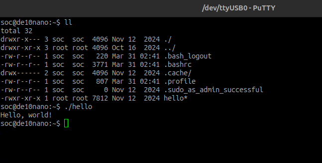

# Lab 3: Developer's Setup

## Overview
In this lab, I created two servers in order to more easily transfer information to my SoC FPGA. One server is a TFTP
server, which the SoC uses to network boot from when it's connected to my laptop via an ethernet cable. Here, I can
ensure that the FPGA is programmed with an .rbf file of my choice. The other server, an NFS server, was set up to
essentially mount the SoC's filesystem onto my PC's. This enables me to immediately move/copy files to and from the
SoC and my PC. This will be very useful when developing code to run on the ARM.

P.S. I learned a bit about linux servers.

## Deliverables

Here is a screenshot of the PuTTY terminal that I communicate with the SoC on. As you can see, the "hello" 32-bit ARM
binary is executed and "Hello, world!" is printed.

